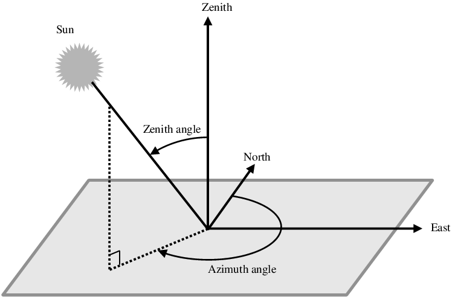
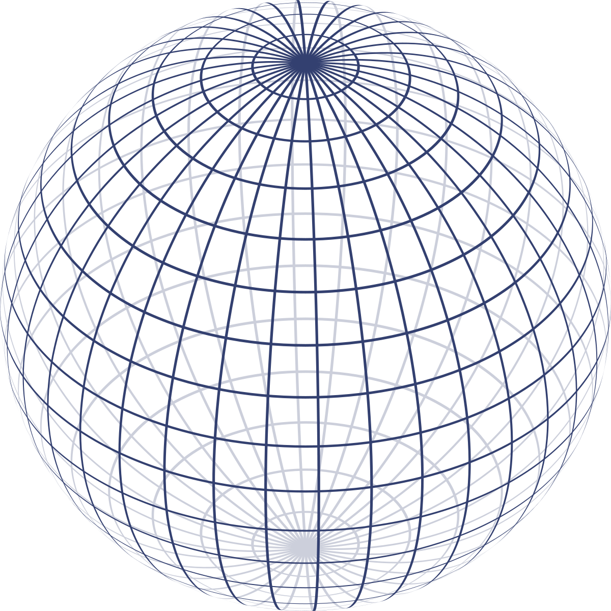
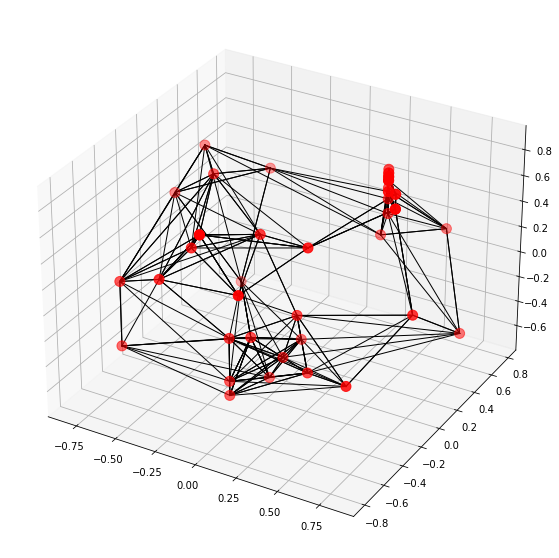

# Report

## The detector

## A regression problem

We want to infer the direction a neutrino comes from. This is a **2-variable regression task**: we want to predict the azimuth $\theta$ ($\in [0, 2\pi]$) and the zenith $\phi$ ($\in [0, \pi]$).

For regression, the simplest approach is to take the ground truth angles as targets, and use the MSE/MAE as a loss function. Yet, **here, it won't work as expected. Why ?** 

Because **our targets are angles!** Let's consider a simple example: a neutrino has a ground truth azimuth of $0.01\pi$. Let's say our model predicts $1.99\pi = -0.01\pi[2\pi]$. Its prediction is almost perfect, yet the loss function will heavily penalize this inference. We need a periodicity-robust approach !

I tried two approaches, which both give similar results :
- predict the $\cos$ and $\sin$ of each angle
- predict the equivalent $(x,y,z)$ 3D-coordinates, then convert using $\phi=\arccos(\frac{z^2}{x^2+y^2+z^2})$ and $\theta=\arctan(\frac{y}{x})$

## A classification approach ?

In https://arxiv.org/pdf/1702.01499.pdf, the authors convert the regression problem into a classification one. This allows to solve the unbalanced dataset (azimuths are uniformly distributed, but not zeniths, due to the spheric coordinates). In their paper, the authors discretize the unit sphere into a disco-like ball. The goal is then to attribute a face to each event. The only drawback of this approach is the accuracy of the prediction. The more you discretize the ball, the more precise the prediction. But, the more you discretize the ball, the more classes you have, and the harder the classification task becomes. A solution is to discretize enough ($60 \times 60 = 360$ classes) and then predict a small correction $\delta \theta$ and $\delta \phi$ (a bit like in performed in object detection models using anchors + small coords correction regression).

## How to convert predictions into an ML input ?

A simple approach is to convert each event into a 3D image, where pixels would be sensors, and then apply a 3D Convolutional Neural Network to perform the regression task, in a supervized manner. Yet there are two major drawbacks to this approach. 
- During an event, only a few sensors detect a pulse. So the 3D event representation would be really sparse (most pixels would have null values)
- The sensors are not placed in a regular and cubic geometry (because of the Deep Core).

Then, I considered Graph Neural Networks. An event is a cloud of points, with features. They are detected at various known 3D-positions, so we can build a graph using k-NN. Then using a GNN, we can perform regression. Note that in litterature, most GNNs perform classification tasks. Maybe GNNs perform poorly on regression tasks ?

I tried two architectures:

- A simple GCN using SageConv convolutions $\rightarrow$ **1.17**
- DynEdge, from the GraphNet paper (loss MAE) $\rightarrow$ **1.083**

## Best solution

The top teams used Transformers. The idea was to see an event as a sequence of detections. One detection = a token.

Link to an excellent report : https://www.kaggle.com/competitions/icecube-neutrinos-in-deep-ice/discussion/402882